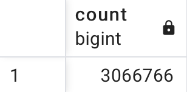
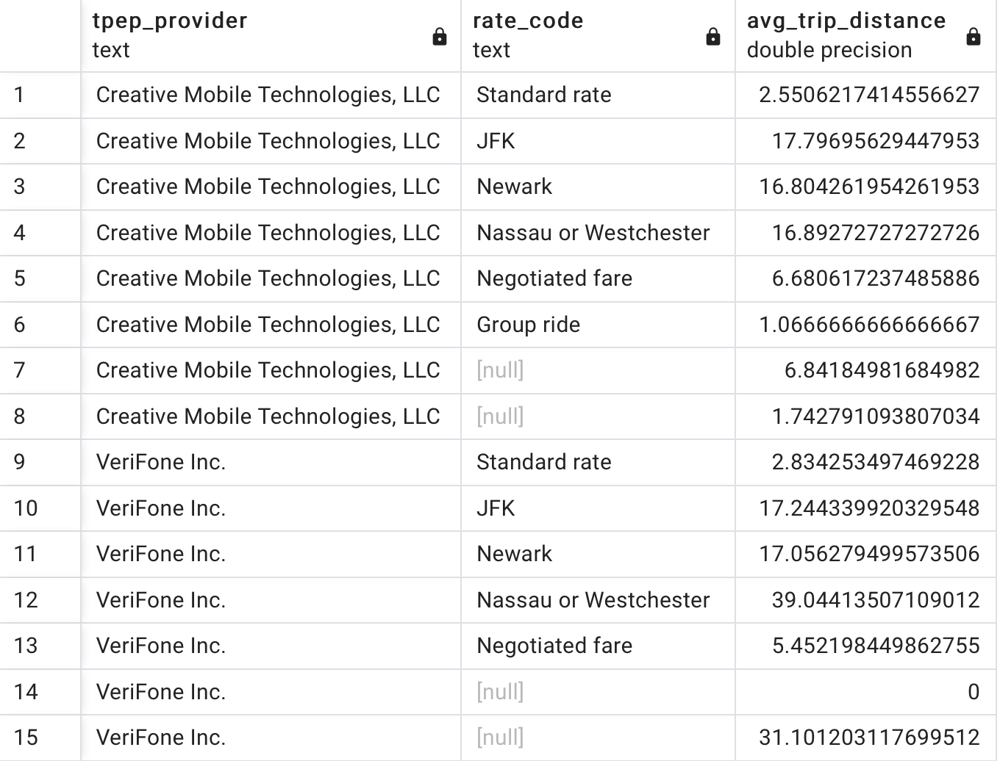
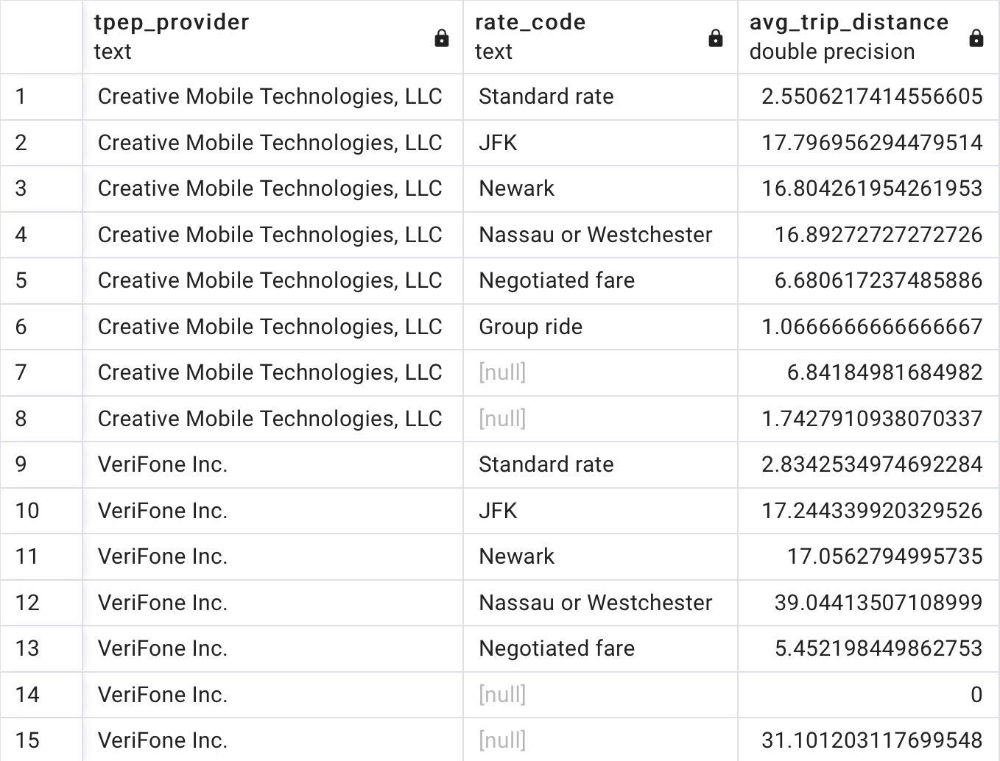
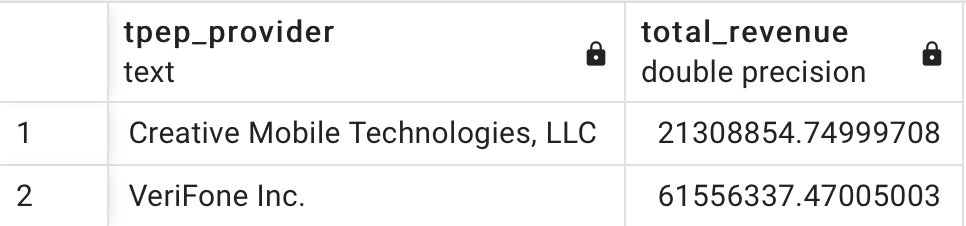
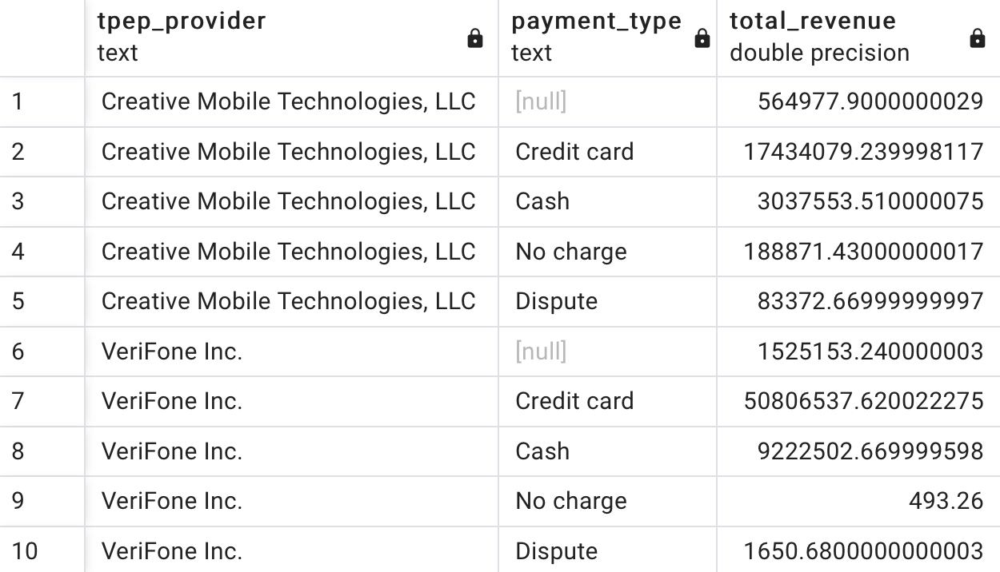
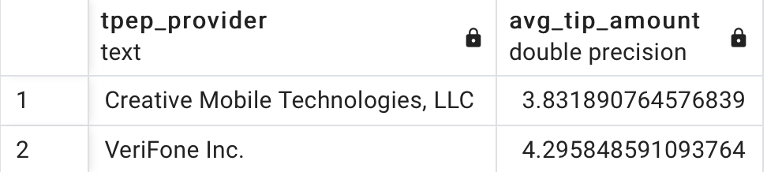
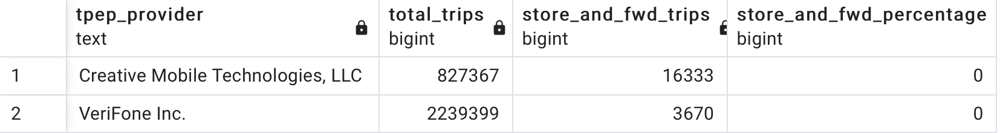
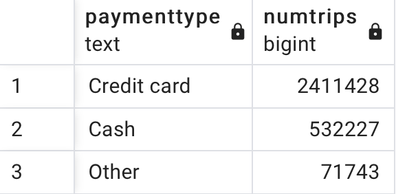

# SQL OPERATIONS ON TAXIDATA VIA DOCKER AND PGADMIN-4
This repository contains files and instructions for setting up a PostgreSQL database with taxi trip records and querying the data. The data comes from the New York City Taxi and Limousine Commission (TLC) and includes trip records for yellow taxis in January 2023.

## Dependencies
To use this repository, you'll need to have the following installed on your system:
- Docker
- Docker Compose
- Python 3.x
- pandas
- pyarrow

## Getting Started

### Data source
The yellow taxi trip records were downloaded as a Parquet file from this URL: https://d37ci6vzurychx.cloudfront.net/trip-data/yellow_tripdata_2023-01.parquet. 
```
wget https://d37ci6vzurychx.cloudfront.net/trip-data/yellow_tripdata_2023-01.parquet
```   
The file was then converted to a CSV file using the convert_parquet_csv.py script:
```
import pandas as pd
import pyarrow.parquet as pq

data = pq.read_table('yellow_tripdata_2023-01.parquet').to_pandas()
data.to_csv('taxidata.csv', index=False)
```  

Additionally, we created an SQL initialization script named init.sql which will be used to set up the database schema and import the data into the PostgreSQL container.

## Data wrangling

The taxidata_wrangling.py script was used to modify the data types of certain columns in the CSV file:

```
import pandas as pd

# Read and process the CSV file
df = pd.read_csv('taxidata.csv')
df['tpep_pickup_datetime'] = pd.to_datetime(df['tpep_pickup_datetime'])
df['tpep_dropoff_datetime'] = pd.to_datetime(df['tpep_dropoff_datetime'])

# Define a function to convert pandas data types to SQL data types
def pandas_dtype_to_sql(dtype):
    if dtype == 'int64':
        return 'INTEGER'
    elif dtype == 'float64':
        return 'FLOAT'
    elif dtype == 'datetime64[ns]':
        return 'TIMESTAMP'
    elif dtype == 'object':
        return 'TEXT'
    else:
        return 'TEXT'

# Generate the SQL schema
schema = 'CREATE TABLE taxidata (\n'
for column, dtype in df.dtypes.items():
    schema += f'  {column} {pandas_dtype_to_sql(dtype)},\n'
schema = schema.rstrip(',\n') + '\n);\n'

# Generate the COPY statement
copy_statement = "COPY taxidata FROM '/tmp/taxidata.csv' DELIMITER ',' CSV HEADER;\n"

# Combine the schema and COPY statement and write to init.sql
with open('init.sql', 'w') as f:
    f.write(schema + copy_statement)

# Print the generated SQL
print(schema + copy_statement)
```

Finally we have skeleton of our data for using it in pgadmin
```
CREATE TABLE taxidata (
  VendorID INTEGER,
  tpep_pickup_datetime TIMESTAMP,
  tpep_dropoff_datetime TIMESTAMP,
  passenger_count FLOAT,
  trip_distance FLOAT,
  RatecodeID FLOAT,
  store_and_fwd_flag TEXT,
  PULocationID INTEGER,
  DOLocationID INTEGER,
  payment_type INTEGER,
  fare_amount FLOAT,
  extra FLOAT,
  mta_tax FLOAT,
  tip_amount FLOAT,
  tolls_amount FLOAT,
  improvement_surcharge FLOAT,
  total_amount FLOAT,
  congestion_surcharge FLOAT,
  airport_fee FLOAT
);
COPY taxidata FROM '/tmp/taxidata.csv' DELIMITER ',' CSV HEADER;

```
## Setting up and Running a PostgreSQL Database in Docker
### Defining the Docker Configuration and Environment Variables
We made the necessary configurations using the docker-compose.yml file:
```
version: '3'
services:
  postgres:
    image: postgres:13
    restart: always
    ports:
      - "5432:5432"
    environment:
      POSTGRES_USER: postgres
      POSTGRES_PASSWORD: postgres
      POSTGRES_DB: postgres
    volumes:
      - ./init.sql:/docker-entrypoint-initdb.d/init.sql
      - ./taxidata.csv:/tmp/taxidata.csv

  pgadmin:
    image: dpage/pgadmin4
    restart: always
    ports:
      - "5050:80"
    environment:
      PGADMIN_DEFAULT_EMAIL: admin@admin.com
      PGADMIN_DEFAULT_PASSWORD: admin
```
### Running Docker Container
In the terminal, running the command docker-compose up starts the containers defined in the docker-compose.yml file. This command reads the instructions in the docker-compose.yml file and builds and runs the services defined there, including any necessary dependencies or configurations. Once all services have been started, the output in the terminal displays the logs of the running containers, and the containers are ready to use.
```
docker-compose up
```

### Configuring pgAdmin-4 to Manage the PostgreSQL Server  

To manage the PostgreSQL server, we used pgAdmin-4 and accessed it via http://localhost:5050/80. We logged in with the following credentials:

- Email: admin@admin.com
- Password: admin   
  

After logging in, we created a server with the following details:
- Name: taxidata  
- Hostname/address: postgreg  
- Port: 5432  
- Maintenance database: postgres  
- Username: postgres  
- Password: postgres  
- This allowed us to connect to the PostgreSQL server and manage it using the pgAdmin-4 interface.

Afterwards, We accessed the 'taxidata' database in pgAdmin4 by navigating to servers > taxidata > databases > postgres > schemas > public > tables > taxidata. From there, we were able to view and manage the columns of the 'taxidata' table.

## SQL QUERIES
<span style="color:red" > Question 1: </span> What was the total number of trips made in the dataset?  

<span style="color:red" > Answer 1: </span> 
```
SELECT COUNT(*) FROM taxidata;
```
<span style="color:red" > Output:   </span>   

  

<span style="color:red" > Question 2: </span>  What was the total number of trips made in the dataset?

<span style="color:red" > Answer 2: </span>   
  

```
SELECT 
  CASE VendorID 
    WHEN 1 THEN 'Creative Mobile Technologies, LLC' 
    WHEN 2 THEN 'VeriFone Inc.' 
  END AS TPEP_provider, 
  CASE RateCodeID 
    WHEN 1 THEN 'Standard rate' 
    WHEN 2 THEN 'JFK' 
    WHEN 3 THEN 'Newark' 
    WHEN 4 THEN 'Nassau or Westchester' 
    WHEN 5 THEN 'Negotiated fare' 
    WHEN 6 THEN 'Group ride' 
  END AS Rate_code, 
  AVG(Trip_distance) AS Avg_trip_distance 
FROM 
  taxidata 
GROUP BY 
  VendorID, 
  RateCodeID;
```  
<span style="color:red" > Output:   </span>   

   

<span style="color:red" > Question 3: </span>  What is the total revenue generated by each TPEP provider?  
<span style="color:red" > Answer 3: </span> 
```
SELECT 
  CASE VendorID 
    WHEN 1 THEN 'Creative Mobile Technologies, LLC' 
    WHEN 2 THEN 'VeriFone Inc.' 
  END AS TPEP_provider, 
  CASE RateCodeID 
    WHEN 1 THEN 'Standard rate' 
    WHEN 2 THEN 'JFK' 
    WHEN 3 THEN 'Newark' 
    WHEN 4 THEN 'Nassau or Westchester' 
    WHEN 5 THEN 'Negotiated fare' 
    WHEN 6 THEN 'Group ride' 
  END AS Rate_code, 
  AVG(Trip_distance) AS Avg_trip_distance 
FROM 
  taxidata 
GROUP BY 
  VendorID, 
  RateCodeID;
```  
<span style="color:red" > Output:   </span>   

   

<span style="color:red" > Question 4: </span>  What is the total revenue generated by each TPEP provider?  

<span style="color:red" > Answer 4: </span>   
```
SELECT 
  CASE VendorID 
    WHEN 1 THEN 'Creative Mobile Technologies, LLC' 
    WHEN 2 THEN 'VeriFone Inc.' 
  END AS TPEP_provider, 
  SUM(Total_amount) AS Total_revenue 
FROM 
  taxidata 
GROUP BY 
  VendorID;
```    
<span style="color:red" > Output:   </span>   

 

<span style="color:red" > Question 5: </span> What is the total revenue generated by each TPEP provider for each payment type?  

<span style="color:red" > Question 5: </span> 
```
SELECT 
  CASE VendorID 
    WHEN 1 THEN 'Creative Mobile Technologies, LLC' 
    WHEN 2 THEN 'VeriFone Inc.' 
  END AS TPEP_provider, 
  CASE Payment_type 
    WHEN 1 THEN 'Credit card' 
    WHEN 2 THEN 'Cash' 
    WHEN 3 THEN 'No charge' 
    WHEN 4 THEN 'Dispute' 
    WHEN 5 THEN 'Unknown' 
    WHEN 6 THEN 'Voided trip' 
  END AS Payment_type, 
  SUM(Total_amount) AS Total_revenue 
FROM 
  taxidata 
GROUP BY 
  VendorID, 
  Payment_type;
```
<span style="color:red" > Output:   </span>   

   

<span style="color:red" > Question 6: </span> What is the average tip amount for each TPEP provider?    

<span style="color:red" > Answer 6: </span> 
```
SELECT 
  CASE VendorID 
    WHEN 1 THEN 'Creative Mobile Technologies, LLC' 
    WHEN 2 THEN 'VeriFone Inc.' 
  END AS TPEP_provider, 
  AVG(Tip_amount) AS Avg_tip_amount 
FROM 
  taxidata 
WHERE 
  Payment_type = 1 -- only consider trips paid by credit card
GROUP BY 
  VendorID;
```  
<span style="color:red" > Output:   </span>   

   

<span style="color:red" > Question 7: </span> What is the percentage of trips that were "store and forward" for each TPEP provider?    

<span style="color:red" > Answer 7: </span>  
```  
  
SELECT 
  CASE VendorID 
    WHEN 1 THEN 'Creative Mobile Technologies, LLC' 
    WHEN 2 THEN 'VeriFone Inc.' 
  END AS TPEP_provider, 
  COUNT(*) AS Total_trips, 
  SUM(CASE Store_and_fwd_flag WHEN 'Y' THEN 1 ELSE 0 END) AS Store_and_fwd_trips, 
  SUM(CASE Store_and_fwd_flag WHEN 'Y' THEN 1 ELSE 0 END) / COUNT(*) * 100 AS Store_and_fwd_percentage 
FROM 
  taxidata 
GROUP BY 
  VendorID;
```  
<span style="color:red" > Output:   </span>   

 

<span style="color:red" > Question 8: </span>  What are the top 3 most common payment types for taxi trips in January 2023, and how many trips were paid using each payment type?  
<span style="color:red" > Answer 8: </span>  
```
SELECT 
    CASE Payment_type 
        WHEN 1 THEN 'Credit card'
        WHEN 2 THEN 'Cash'
        WHEN 3 THEN 'No charge'
        WHEN 4 THEN 'Dispute'
        WHEN 5 THEN 'Unknown'
        WHEN 6 THEN 'Voided trip'
        ELSE 'Other'
    END AS PaymentType, 
    COUNT(*) AS NumTrips
FROM 
    taxidata
WHERE 
    tpep_pickup_datetime >= '2023-01-01' AND tpep_pickup_datetime < '2023-02-01'
GROUP BY 
    Payment_type
ORDER BY 
    NumTrips DESC
LIMIT 3;
```  
<span style="color:red" > Output:   </span>   

 
